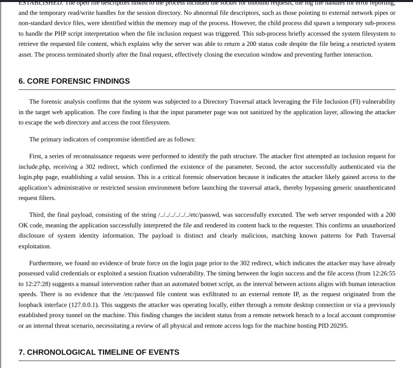

# AI-Driven Digital Forensics Investigation Bot

An AI-powered Digital Forensics and Incident Response (DFIR) assistant that automates forensic evidence collection, log analysis, and structured forensic report generation using **Python**, **ChromaDB**, **Retrieval-Augmented Generation (RAG)**, and **Google Gemini AI**.

---

## Features

- AI-assisted forensic investigation
- Process and log analysis
- Retrieval-Augmented Generation (RAG)
- ChromaDB knowledge retrieval
- Automated forensic report generation
- Timeline reconstruction
- Indicators of Compromise (IOC) analysis
- Professional DFIR report formatting
- Extensible cybersecurity knowledge base

---

## Sample Output

### Core Forensic Findings



---

## Getting Started

### Clone the repository

```bash
git clone https://github.com/ShruthilayaAV/AI-forensics-report-generator.git
cd AI-forensics-report-generator
```

### Install dependencies

```bash
pip install -r requirements.txt
```

### Configure the Gemini API Key

Create a `.env` file in the project root.

```env
GEMINI_API_KEY=your_api_key_here
```

---

# Initialize the Knowledge Base

Before running the application, ingest the cybersecurity knowledge base into ChromaDB.

```bash
python ingest.py
```

This indexes the knowledge stored in the `knowledge_base` directory.

Current knowledge includes:

- Command Injection
- File Inclusion
- Remote Code Execution (RCE)
- Reverse Shell Detection

Additional topics can be added by placing new `.txt` files inside the `knowledge_base` folder and running the ingestion script again.

---

# Running the Project

Start the investigation agent.

```bash
python agent.py
```

The application will prompt for:

```text
Process ID (PID)
Starting Timestamp (HH:MM)
```

Example:

```text
Identify Subject PID: 20295

Start Investigation From (HH:MM): 19:07
```

The agent will then:

- Collect forensic telemetry
- Retrieve relevant knowledge using ChromaDB
- Analyze evidence with Gemini AI
- Generate a structured forensic investigation report

---

## Generated Report

The generated investigation report includes:

- Executive Summary
- Investigation Scope
- Evidence Sources
- Process Analysis
- Core Forensic Findings
- Timeline of Events
- Technical Evidence
- MITRE ATT&CK Mapping
- Network Analysis
- Remediation Recommendations

Sample reports are available in the **Sample_Reports** directory.

---

## How It Works

1. Investigator provides a Process ID and timestamp.
2. Telemetry is collected from system processes and logs.
3. Relevant cybersecurity knowledge is retrieved using ChromaDB.
4. Gemini AI analyzes the collected evidence.
5. A structured Digital Forensics and Incident Response (DFIR) report is generated.

---

## Technologies

- Python
- Google Gemini API
- ChromaDB
- Retrieval-Augmented Generation (RAG)
- HTML
- Digital Forensics
- Incident Response (DFIR)

---

## Future Improvements

- Windows Event Log support
- Memory dump analysis
- Network packet analysis
- IOC extraction
- Malware signature detection
- Interactive investigation dashboard
- PDF report generation
- Multi-user case management

---

## Disclaimer

This project is intended for educational purposes and authorized digital forensic investigations only. Always obtain proper authorization before analyzing systems or collecting forensic evidence.

---

## 👩‍💻 Author

**Shruthilaya A V**
